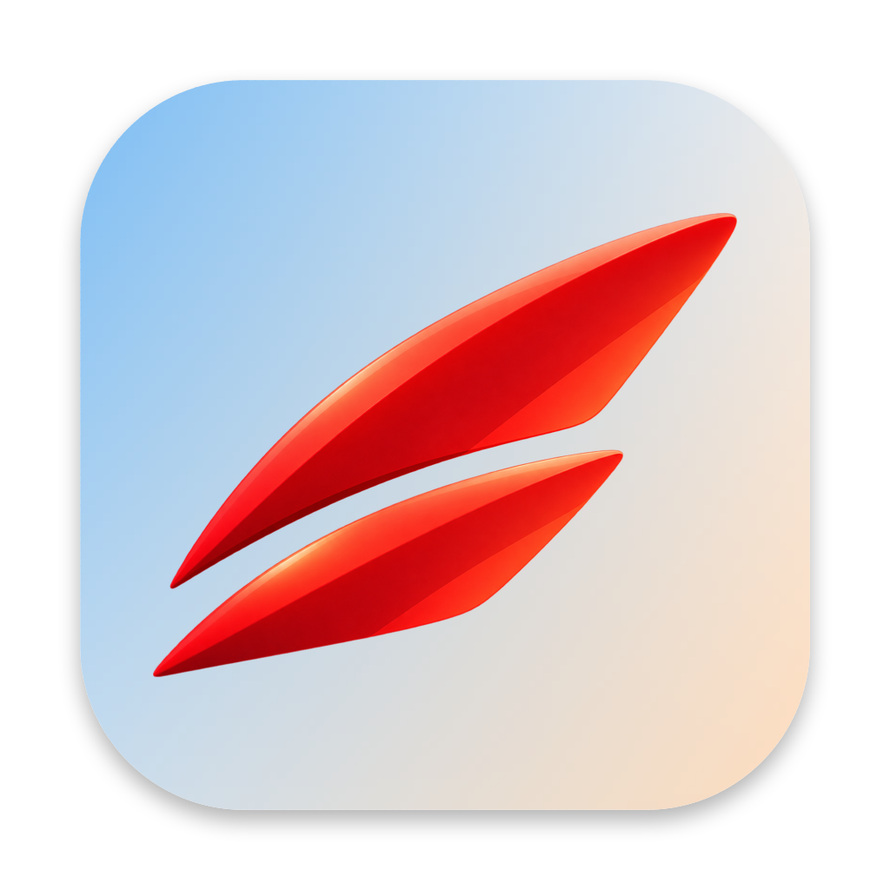

# Savoia



A minimal macOS browser with tabs, tab groups and two tabs side by side. The scrollable-tiling row it grew out of,
and the iOS, Linux, Windows and Android fronts built on that row, live on the `dev` branch.

It is a playground for three things:

1. **SwiftUI + WebKit on the macOS 26+ APIs** — a SwiftUI interface over a `WKWebView` per tab, with several profiles
   in one window. It began on SwiftUI's own `WebView` / `WebPage` and left it when most of what a browser needs
   turned out to start with taking the view anyway ([docs/architecture.md](docs/architecture.md#from-webpage-to-wkwebview)). Each profile is an isolated `WKWebsiteDataStore(forIdentifier:)` and has its own tabs and groups.
   ⌘T / ⌘W / ⌘L.
2. **Foundation Models (macOS 27) as the single LLM API** — a Dia-style one-line assistant (⌘E) driven by
   `LanguageModelSession`, switchable between the on-device `SystemLanguageModel`, `PrivateCloudComputeLanguageModel`
   and Claude (`ClaudeLanguageModel` from [anthropics/ClaudeForFoundationModels](https://github.com/anthropics/ClaudeForFoundationModels),
   which conforms to the new `LanguageModel` protocol). Page text is sent as context. There is no official OpenAI
   provider for this protocol yet, so GPT is not wired up.
3. **ACP (Agent Client Protocol) in Swift** — `Savoia/ACP/` is a self-contained client: JSON-RPC over stdio,
   `initialize` / `session/new` / `session/prompt` / `session/cancel` / `session/set_mode`, streaming `session/update`,
   `session/request_permission`, and `fs/read_text_file` / `fs/write_text_file` served from the app (restricted to the
   session cwd). Built-in agents: Claude Code (`@agentclientprotocol/claude-agent-acp`) and Codex
   (`@agentclientprotocol/codex-acp`). The agent panel entry points are temporarily commented out.
4. **The browser as an MCP server** — the same binary run as `Savoia --mcp` is a stdio MCP server relaying to the
   running app over a Unix socket. Every ACP session gets it in `mcpServers`, so agents can open tabs into a
   named group, read and summarize pages, move and close tabs — the same tool catalog the assistant uses.
   With `savoia://settings` ▸ **Develop** ▸ Capture Console and Network on, that catalog also answers what a page logged and what it
   requested (`list_console_messages`, `list_network_requests`, `take_screenshot`) — Chrome's devtools-MCP moves, on
   WebKit. `WKWebView.isInspectable` puts Savoia's pages in Safari's own Develop menu.
   See [docs/mcp.md](docs/mcp.md) and [docs/devtools.md](docs/devtools.md).

Tabs, groups, profiles and agent chats survive a relaunch: one JSON snapshot under Application Support, autosaved
on change, ACP sessions resumed with `session/load`. See [docs/architecture.md](docs/architecture.md#persistence).

A tab is not a page it holds forever. A web view is a web content process, so a hundred tabs keep only as many live
as the machine can carry and *discard* the rest, the way Chrome's Memory Saver and Safari's suspended tabs do — the tab
stays where it is, with its address, its history, its scroll offset and a picture of itself, and builds the same page
again when you come back to it.
See [docs/architecture.md](docs/architecture.md#live-pages).

Ads and trackers are blocked out of the box, by WebKit itself: filter lists are converted to WebKit's content-blocker
JSON and compiled into `WKContentRuleList`s, so a blocked request never leaves the content process and nothing runs
inside the page. Every tab has its own content controller, which is what makes the per-site allowlist — the shield
in the address field — a reload rather than a ten-second recompile. `savoia://settings` ▸ **Privacy** has the switch (off means
off: nothing fetched, nothing compiled), the lists and the sites left alone.
See [docs/blocking.md](docs/blocking.md).

Some sites are served under a certificate authority no Apple machine has ever heard of — Russian banks under the
Ministry of Digital Development's CA are the case this was built for — and to a browser those look exactly like an
attack. Savoia carries that authority switched **off** and puts a switch beside it on `savoia://settings` ▸ **Privacy**, along with a
way to import your own. Turning one on does less than the keychain would: the system judges every chain first,
untouched, and only a chain it has already turned down is read a second time with the extra anchors *added*. So trust
here belongs to Savoia alone, nothing else on the machine is affected, and switching it off takes it back.
See [docs/certificates.md](docs/certificates.md).

Browser extensions run too, on `WKWebExtension` — installed from a folder, a `.zip`, a `.crx` or an `.xpi`, one
controller per profile, never in a private window. An extension's own pages open as tabs. What works is
measured rather than guessed, and every install says what it costs *that* extension before it runs.
See [docs/extensions.md](docs/extensions.md).

The interface speaks English and Russian: one String Catalog for the app, another for what the system shows on its
behalf (the camera prompt, the document types in the Finder), plural forms and all. What a *model* reads — the tool
catalog's instructions, every tool description, the research preset — stays English, because that is a prompt rather
than an interface.
See [docs/localization.md](docs/localization.md).

Savoia registers with macOS as a browser: it claims `http`/`https` and the usual web file types, so it can be picked in
System Settings › Desktop & Dock › Default web browser (or from **Set Savoia as Default Browser…** in the Savoia menu), and
links or `.html` files opened from other apps land as tabs.
See [docs/architecture.md](docs/architecture.md#being-a-browser).

## Tabs

The window is a tab bar, a toolbar with the address field under it, and the page in front. Tabs gather into
**groups** — coloured, named, folded up to their label with a click — and can be **pinned** to the left edge, picked
several at a time with `⌘`/`⇧`-click, and shown **two side by side**. With Configuration ▸ Tabs ▸ Group Tabs by
Meaning on, a new tab goes into the group it is about, sorted on this Mac by the bookmark index's own embeddings or a
small local model. `⌃Tab` flies back to the tab you were just in, over pictures of every tab in the order they were
looked at. See [docs/layout.md](docs/layout.md) and [docs/hotkeys.md](docs/hotkeys.md).

A new tab opens on Savoia's own start page — one field for both queries and addresses, so the first thing a tab does
isn't a network request. Under it, in this order: what you **saved**, what you **visited**, what the engine
**guesses**. The first of those is the search being personal — the query is embedded on this Mac and put to the
bookmarks' vector index, so it answers across languages and without the words matching («плов» finds the English page
about pilaf you kept). See [docs/start-page.md](docs/start-page.md).

User guide (Russian and English, published on the deffun site under `/docs/vi/`): [docs/guide/](docs/guide/).

Full reference: [docs/](docs/) — [controls](docs/controls.md), [hotkeys](docs/hotkeys.md), [tabs](docs/layout.md),
[architecture](docs/architecture.md), [blocking](docs/blocking.md), [certificates](docs/certificates.md),
[extensions](docs/extensions.md), [devtools](docs/devtools.md), [assistant](docs/assistant.md),
[agents](docs/agents.md), [MCP server](docs/mcp.md), [build](docs/build.md).

```
Savoia/Tiling      TilingLayout — tab groups and columns (a tab, or two side by side), focus and moves
Savoia/Browser     Profile, BrowserTab (its own WKWebView), BrowserState, SearchEngine + SearchSuggestions
Savoia/DevTools    DevToolsStore (Web Inspector + capture), PageInstrumentation (the page-world hooks)
Savoia/Extensions  ExtensionStore (a controller per profile), ExtensionInstaller (+ the compatibility verdict), adapters
Savoia/Blocking    ContentBlocker (compiles + attaches rules), FilterList/FilterListStore (the lists), RuleConversion
Savoia/Browser     CertificateStore + ServerTrust (extra trust anchors), BundledCertificates (the ones Savoia ships)
Savoia/Views       ContentView, TabStripView (tab bar + toolbar), TabPageView, ConfigurationPageView, StartPage, AssistantBar
Savoia/Assistant   ModelChoice/AssistantSettings (model selection), AssistantStore (streaming), FM compatibility probe
Savoia/ACP         ACPJSON, JSONRPCConnection, ACPTypes, ACPAgent (process), ACPClient (actor), AgentSessionStore (VM)
Savoia/Tools       BrowserToolCatalog (the tools, over BrowserState), BrowserModelTool (Foundation Models adapter)
Savoia/MCP         MCPServer + MCPHost (the catalog over a Unix socket), MCPSocket (listener), MCPStdioBridge (`Savoia --mcp`)
```

## Testing ACP

Adapters are plain npm packages. The agent panel checks the toolchain in your shell's environment (an interactive login `zsh`, so `.zshrc` counts):

- adapter binary on PATH (`claude-agent-acp` / `codex-acp`) → used directly;
- only `npm` available → **Install** button runs `npm install -g <adapter>`; until then the agent starts via `npx -y`;
- no Node.js at all → link to https://nodejs.org/en/download;
- the underlying CLI (`claude` / `codex`) must be installed and logged in — the panel warns if it's missing.

Manual check from a terminal (what the panel does under the hood):

```sh
npm install -g @agentclientprotocol/claude-agent-acp @agentclientprotocol/codex-acp
claude-agent-acp   # then paste, one line each:
{"jsonrpc":"2.0","id":1,"method":"initialize","params":{"protocolVersion":1,"clientCapabilities":{"fs":{"readTextFile":true,"writeTextFile":true}}}}
{"jsonrpc":"2.0","id":2,"method":"session/new","params":{"cwd":"/tmp","mcpServers":[]}}
{"jsonrpc":"2.0","id":3,"method":"session/prompt","params":{"sessionId":"<id from above>","prompt":[{"type":"text","text":"hi"}]}}
```

With the agent panel re-enabled: pick the agent → send a message (it works in the profile's scratchpad, `Profiles/<name>/Scratchpad`, unless you choose another). Tool calls, plans and permission
requests show up in the transcript; permission buttons answer `session/request_permission`.

## Notes / caveats

- **Toolchain.** The app builds with the active Xcode's own macOS SDK (Xcode 27.2 beta today) — see
  [docs/build.md](docs/build.md#sdk). `FoundationModelsCompatibility` probes the Foundation Models executor ABI at
  launch and disables the remote models with an explanation if the runtime and the SDK diverge.
- The remote models come from packages: [ClaudeForFoundationModels](https://github.com/anthropics/ClaudeForFoundationModels)
  and Apple's [foundation-models-utilities](https://github.com/apple/foundation-models-utilities) (`ChatCompletionsLanguageModel`).
- App Sandbox is off because the ACP layer spawns `npx`/`claude`/`codex` from the user's toolchain.
- Claude Code refuses to run nested inside another Claude Code session; the ACP layer strips `CLAUDECODE` from the
  agent environment. Choose the agent and its model in Configuration → Assistant → Responses; each agent supplies its own model list.
- The Anthropic API key for the assistant is stored in `UserDefaults` for development only.
