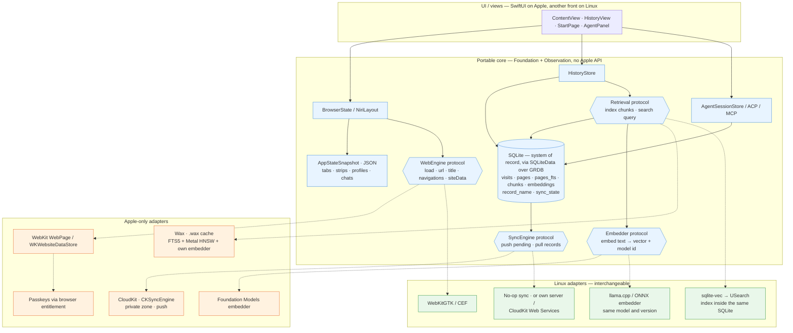

# Storage and the portability seams — plan

*Where data lives, what is portable, and what is an Apple-only adapter behind a protocol. The next step is the
SQLite move ([todo.md](todo.md#storage-sqlite-under-history-with-rag-in-mind)); the rest of the diagram is the
shape that step must not break. Related: [sync.md](sync.md), [passkeys.md](passkeys.md).*

## Reading it

- **Solid arrows** are the portable core. Everything there builds on Linux as it is: the JSON snapshot (already),
  SQLite through GRDB (next), and four protocol seams.
- **Dotted arrows** are implementations of the seams — Apple on the left, the Linux replacement on the right. The
  core doesn't know which one is plugged in.
- **SQLite is the only system of record.** Wax, `sqlite-vec`, USearch are rebuildable indexes over it; losing one is
  harmless, and the `.wax` file is never synced.
- **`Embedder` returns a model id.** That is what keeps vectors compatible across devices and platforms: a chunk
  embedded by another model is re-embedded, not silently searched.
- **`DB`, `HistoryStore` and `SettingsStore` over it exist** (`six/Data/`, `six/Browser/History.swift`). `Retrieval`, `Embedder` and `SyncEngine` are empty
  (or not yet there); what matters today is that `HistoryStore` and the coming `PageStore` / `ChunkStore` import no
  Apple framework, so the seams can appear without a rewrite.

## The seams, and what is still open

| seam | Apple | Linux | note |
|---|---|---|---|
| Web | `WebPage` (exists) | WebKitGTK / CEF | the most expensive seam; a Linux front is a different UI anyway, so in practice this is "keep the model out of the views", which is already the case |
| Embedder | Foundation Models / MiniLM inside Wax | llama.cpp, ONNX | either one cross-platform model everywhere (simpler) or model ids + re-embedding |
| Retrieval | Wax | `sqlite-vec` → USearch | the Mac can start on `sqlite-vec` too — one implementation for all, Wax as a later upgrade |
| Sync | SQLiteData's `SyncEngine` over CloudKit | no-op / own server | without an Apple account a Linux build cannot reach iCloud at all; accept that |
