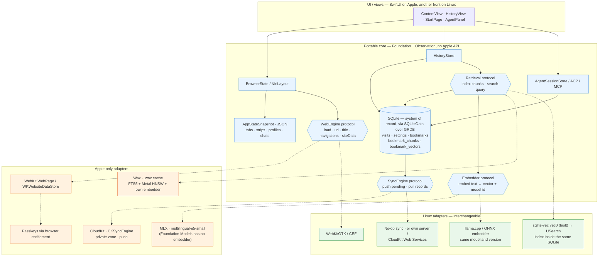

# Storage and the portability seams — plan

*Where data lives, what is portable, and what is an Apple-only adapter behind a protocol. SQLite (SQLiteData over
GRDB) is built; the diagram is the shape the remaining seams must fit
([todo.md](todo.md#storage-history-pages-and-retrieval)). Related: [sync.md](sync.md), [passkeys.md](passkeys.md).*

## Reading it

- **Solid arrows** are the portable core: the JSON snapshot, SQLite through GRDB, and four protocol seams. Only
  the Linux build of SQLiteData itself was the open question, and it now has an answer — below.
- **Dotted arrows** are implementations of the seams — Apple on the left, the Linux replacement on the right. The
  core doesn't know which one is plugged in.
- **SQLite is the only system of record.** The `vec0` tables (sqlite-vec) are rebuildable indexes over it, as Wax or
  USearch would be; losing one is harmless, and a `.wax` file would never be synced.
- **`Embedder` returns a model id.** That is what keeps vectors compatible across devices and platforms: a chunk
  embedded by another model is re-embedded, not silently searched.
- **What exists**: `DB`, `HistoryStore`, `SettingsStore` (`six/Data/`, `six/Browser/History.swift`), and for
  bookmarks the `Embedder` protocol with `MLXEmbedder` (and `ContextualEmbedder`) behind it and `BookmarkStore` as
  the retrieval layer over sqlite-vec (`six/Bookmarks/`, [bookmarks.md](bookmarks.md)). `Retrieval` is not a protocol
  yet — the KNN lives inside `BookmarkStore.vectorSearch`, one function to swap. `SyncEngine` is not there.

## The seams, and what is still open

| seam | Apple | Linux | note |
|---|---|---|---|
| Web | `WebPage` (exists) | WebKitGTK / CEF | the most expensive seam; a Linux front is a different UI anyway, so in practice this is "keep the model out of the views", which is already the case |
| Embedder | multilingual-e5-small over MLX (built); `NLContextualEmbedding` as the no-download alternative | the same model over llama.cpp / ONNX | model ids + re-embedding is what is built: every vector carries its model, a query only meets its own |
| Retrieval | sqlite-vec `vec0` (built) | the same; `sqlite3_auto_extension` works there | on macOS the extension is entered per connection (`sqlite3_vec_init`), since the system SQLite has extension loading compiled out — [bookmarks.md](bookmarks.md#the-index) |
| Sync | SQLiteData's `SyncEngine` over CloudKit | no-op / own server | without an Apple account a Linux build cannot reach iCloud at all; accept that |

## SQLiteData on Linux: it builds, and the pins are why

Swift 6.3.3, aarch64, Ubuntu 24.04, in a container: **GRDB, SQLiteData, sqlite-vec and the `@Table` /
`#sql` macros all build, and so do `AppDatabase`, `SettingsStore`, `History`, `Bookmark` and
`SearchEngine`.** Nothing had to be vendored, and the query layer did not have to be swapped for
`swift-structured-queries` on its own.

What made it look impossible at first was resolving *newer* transitive versions than the app uses.
Both breakages are recent regressions, and both are upstream, not ours:

| package | app's version | newest | what the newest does on Linux |
|---|---|---|---|
| `swift-sharing` | 2.9.1 ✅ | 2.10.0 ❌ | `package import Foundation.NSData` — no such module off Apple |
| `combine-schedulers` | 1.2.0 ✅ | 1.2.1 ❌ | `pthread_mutex_t` under a bare `import Foundation`; Swift 6.3 wants `CoreFoundation` |

2.9.1, 2.8.2 and 2.5.2 of `swift-sharing` all build clean, so 2.10.0 is a regression — and its own CI
claims Linux on Swift 6.3, which makes it worth reporting upstream.

So `Package.swift` names both as **pins rather than uses**: dependencies it declares and never imports,
purely to hold the graph at the versions the app already resolved. That is also the honest statement of
the arrangement — the two builds compile the same sources against the same libraries, which is the only
way a database written by one is safe to open with the other.

**The consequence to remember:** bumping `swift-sharing` or `combine-schedulers` is now a Linux-breaking
change, and it will break in a package six never imports. The pin comments say so.

([sqlite-data#459](https://github.com/pointfreeco/sqlite-data/pull/459) is a separate Linux effort —
CloudKit gating in its own tests, and its GRDB floor. Orthogonal to this, and not needed for it.)

What did have to move is Apple-only Foundation, twice: `String(localized:)` in `NiriLayout` and in
`BookmarkScope.title`. The strings catalog is Apple's too, so on Linux those are the keys and a GTK
front translates them through gettext.
