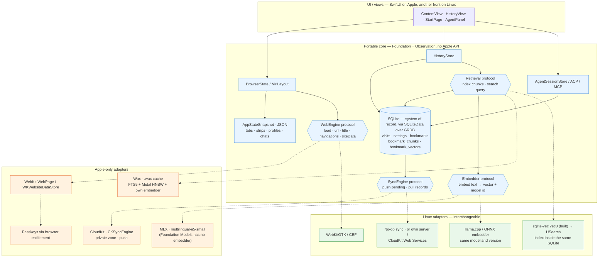

# Storage and the portability seams — plan

*Where data lives, what is portable, and what is an Apple-only adapter behind a protocol. SQLite (SQLiteData over
GRDB) is built; the diagram is the shape the remaining seams must fit
([todo.md](todo.md#storage-history-pages-and-retrieval)). Related: [sync.md](sync.md), [passkeys.md](passkeys.md).*

## Reading it

- **Solid arrows** are the portable core: the JSON snapshot, SQLite through GRDB, and four protocol seams. Only
  the Linux build of SQLiteData itself was the open question, and it now has an answer — below.
- **Dotted arrows** are implementations of the seams — Apple on the left, the Linux replacement on the right. The
  core doesn't know which one is plugged in.
- **SQLite is the only system of record.** The `vec0` tables (sqlite-vec) are rebuildable indexes over it, as Wax or
  USearch would be; losing one is harmless, and a `.wax` file would never be synced.
- **`Embedder` returns a model id.** That is what keeps vectors compatible across devices and platforms: a chunk
  embedded by another model is re-embedded, not silently searched.
- **What exists**: `DB`, `HistoryStore`, `SettingsStore` (`six/Data/`, `six/Browser/History.swift`), and for
  bookmarks the `Embedder` protocol with `MLXEmbedder` (and `ContextualEmbedder`) behind it and `BookmarkStore` as
  the retrieval layer over sqlite-vec (`six/Bookmarks/`, [bookmarks.md](bookmarks.md)). `Retrieval` is not a protocol
  yet — the KNN lives inside `BookmarkStore.vectorSearch`, one function to swap. `SyncEngine` is not there.

## The seams, and what is still open

| seam | Apple | Linux | note |
|---|---|---|---|
| Web | `WebPage` (exists) | WebKitGTK / CEF | the most expensive seam; a Linux front is a different UI anyway, so in practice this is "keep the model out of the views", which is already the case |
| Embedder | multilingual-e5-small over MLX (built); `NLContextualEmbedding` as the no-download alternative | the same model over llama.cpp / ONNX | model ids + re-embedding is what is built: every vector carries its model, a query only meets its own |
| Retrieval | sqlite-vec `vec0` (built) | the same; `sqlite3_auto_extension` works there | on macOS the extension is entered per connection (`sqlite3_vec_init`), since the system SQLite has extension loading compiled out — [bookmarks.md](bookmarks.md#the-index) |
| Sync | SQLiteData's `SyncEngine` over CloudKit | no-op / own server | without an Apple account a Linux build cannot reach iCloud at all; accept that |

## SQLiteData on Linux: measured

Swift 6.3.3, aarch64, Ubuntu 24.04, in a container. **GRDB, StructuredQueries, the `@Table` and `#sql`
macros and sqlite-vec all compile there** — the build reaches 687 of 779 steps before it stops, and it
stops outside all of them.

What stops it is `SQLiteData` depending on `Sharing`, unconditionally
(`sqlite-data/Package.swift`, target dependency, not trait-gated), which reaches `combine-schedulers`,
whose `Internal/Lock.swift` uses `pthread_mutex_t` under a bare `import Foundation`. Swift 6.3 rejects
that: `initializer 'init()' is not available due to missing import of defining module 'CoreFoundation'`
`[#MemberImportVisibility]`. Upstream `main` still has no `import CoreFoundation`, so a version bump does
not help; and because the package sets its own language mode, neither `-Wwarning MemberImportVisibility`
nor `-swift-version 5` on the command line reaches it.

The way out is the one this file already implied. **six uses none of the layer that pulls `Sharing`** —
no `@FetchAll`, no `@Fetch`, no `@Shared` anywhere in `six/`; only `@Table`, `#sql` and
`defaultDatabase`. So on Linux the dependency is `swift-structured-queries` directly, which ships
`StructuredQueriesSQLite` and depends on neither `Sharing` nor `combine-schedulers`. The macros are the
same ones, so **every model file travels unchanged** and only `AppDatabase`'s plumbing — `defaultDatabase`
over a GRDB `DatabaseWriter` — needs a Linux arm.

That is a smaller fallback than "plain GRDB" ([todo.md](todo.md#storage-history-pages-and-retrieval)
assumed the query layer might have to go too; it does not).
